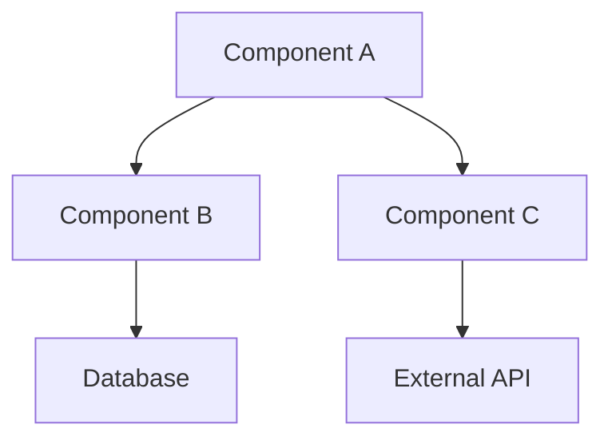
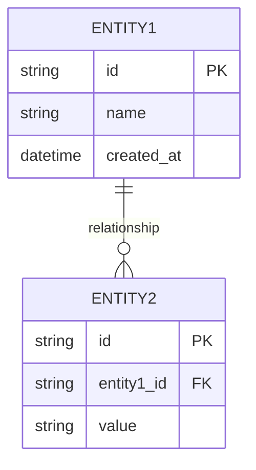
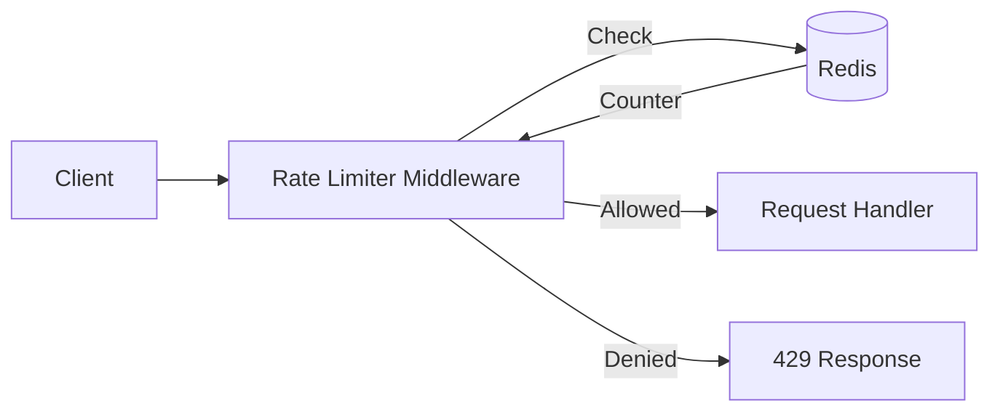
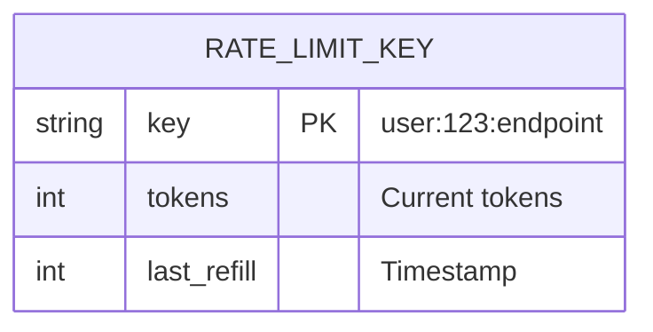

# Design Templates

This document provides templates and examples for creating design.md files.

## Design Document Template

```markdown
# {Feature Name} Design

## Overview

{1-2 paragraphs describing what this feature is and why it's being built.
Should be understandable by someone unfamiliar with the project.}

## Detailed Requirements

{Consolidated from requirements.md. Organize by category.}

### Functional Requirements
- FR1: {Requirement}
- FR2: {Requirement}

### Non-Functional Requirements
- NFR1: {Requirement}
- NFR2: {Requirement}

### Constraints
- C1: {Constraint}
- C2: {Constraint}

## Architecture Overview

{High-level description of the system architecture.}



### Key Architectural Decisions
1. {Decision 1}: {Rationale}
2. {Decision 2}: {Rationale}

## Components and Interfaces

### {Component Name 1}

**Purpose:** {What this component does}

**Responsibilities:**
- {Responsibility 1}
- {Responsibility 2}

**Interface:**
```
{Interface definition - function signatures, API endpoints, etc.}
```

**Dependencies:**
- {Dependency 1}
- {Dependency 2}

---

### {Component Name 2}

{Same structure as above}

## Data Models

### {Entity Name 1}



**Fields:**
| Field | Type | Required | Description |
|-------|------|----------|-------------|
| id | string | yes | Unique identifier |
| name | string | yes | Display name |

**Validation Rules:**
- {Rule 1}
- {Rule 2}

## Error Handling

### Error Categories

| Category | HTTP Status | Example | User Message |
|----------|-------------|---------|--------------|
| Validation | 400 | Missing required field | "Please provide {field}" |
| Not Found | 404 | Resource doesn't exist | "{Resource} not found" |
| Conflict | 409 | Duplicate entry | "{Resource} already exists" |
| Server Error | 500 | Unexpected failure | "Something went wrong. Please try again." |

### Error Response Format
```json
{
  "error": {
    "code": "ERROR_CODE",
    "message": "User-friendly message",
    "details": {}
  }
}
```

## Acceptance Criteria

### AC1: {Scenario Name}
- **Given:** {Initial context}
- **When:** {Action taken}
- **Then:** {Expected outcome}

### AC2: {Scenario Name}
- **Given:** {Initial context}
- **When:** {Action taken}
- **Then:** {Expected outcome}

## Testing Strategy

### Unit Tests
- {Component}: Test {specific behavior}
- {Component}: Test {specific behavior}

### Integration Tests
- {Flow}: Test end-to-end {scenario}
- {Integration}: Test interaction with {external system}

### Edge Cases to Test
- {Edge case 1}
- {Edge case 2}

### Performance Tests (if applicable)
- {Scenario}: Expected {metric}

## Appendices

### A. Technology Choices

| Decision | Options Considered | Chosen | Rationale |
|----------|-------------------|--------|-----------|
| {Choice 1} | {A, B, C} | {A} | {Why A} |
| {Choice 2} | {X, Y, Z} | {Y} | {Why Y} |

### B. Research Findings Summary

{Key findings from research/ directory}

### C. Alternative Approaches

**{Alternative 1}:**
- Description: {What this approach looks like}
- Pros: {Advantages}
- Cons: {Disadvantages}
- Why not chosen: {Reason}

### D. Glossary

| Term | Definition |
|------|------------|
| {Term 1} | {Definition} |
| {Term 2} | {Definition} |
```

---

## Example: Rate Limiter Design

```markdown
# Rate Limiter Design

## Overview

Implement a rate limiting system to protect our API from abuse and ensure fair
usage across clients. The system should support configurable limits per endpoint,
per user, and globally. It should provide clear feedback when limits are exceeded
and integrate seamlessly with our existing authentication middleware.

## Detailed Requirements

### Functional Requirements
- FR1: Limit requests per user per time window
- FR2: Limit requests per IP address for unauthenticated users
- FR3: Support different limits for different endpoints
- FR4: Return rate limit headers in responses
- FR5: Return 429 status when limit exceeded

### Non-Functional Requirements
- NFR1: Add <5ms latency to request processing
- NFR2: Handle 10,000 requests/second
- NFR3: Work in distributed environment (multiple servers)

### Constraints
- C1: Must work with existing Redis infrastructure
- C2: Must not require database queries per request
- C3: Must be configurable without code changes

## Architecture Overview

The rate limiter operates as middleware in the request pipeline, using Redis
for distributed state management.



### Key Architectural Decisions
1. **Token Bucket Algorithm**: Smooth traffic flow, allows bursts within limits
2. **Redis for Storage**: Distributed, fast, atomic operations
3. **Middleware Pattern**: Consistent application across all endpoints

## Components and Interfaces

### RateLimiter

**Purpose:** Core rate limiting logic using token bucket algorithm

**Interface:**
```typescript
interface RateLimiter {
  checkLimit(key: string, limit: number, window: Duration): Promise<LimitResult>
}

interface LimitResult {
  allowed: boolean
  remaining: number
  resetAt: Date
  retryAfter?: number
}
```

### RateLimitMiddleware

**Purpose:** HTTP middleware that applies rate limiting to requests

**Interface:**
```typescript
function rateLimitMiddleware(config: RateLimitConfig): Middleware

interface RateLimitConfig {
  windowMs: number
  maxRequests: number
  keyGenerator: (req: Request) => string
  skip?: (req: Request) => boolean
}
```

### RateLimitConfigLoader

**Purpose:** Load rate limit configurations from external source

**Interface:**
```typescript
interface RateLimitConfigLoader {
  loadConfig(): Promise<EndpointLimits>
}

interface EndpointLimits {
  [pattern: string]: {
    authenticated: number
    anonymous: number
    windowMs: number
  }
}
```

## Data Models

### Rate Limit Counter (Redis)



**Redis Key Structure:**
- Pattern: `ratelimit:{type}:{id}:{endpoint}`
- TTL: 2x window duration
- Example: `ratelimit:user:123:/api/search`

## Error Handling

| Category | HTTP Status | Example | User Message |
|----------|-------------|---------|--------------|
| Rate Limited | 429 | Limit exceeded | "Rate limit exceeded. Retry after {seconds} seconds." |

### Response Headers
```
X-RateLimit-Limit: 100
X-RateLimit-Remaining: 0
X-RateLimit-Reset: 1640000000
Retry-After: 60
```

## Acceptance Criteria

### AC1: Authenticated User Rate Limit
- **Given:** User is authenticated with ID 123
- **When:** They make 101 requests to /api/search within 1 minute
- **Then:** The 101st request returns 429 with Retry-After header

### AC2: Anonymous User Rate Limit
- **Given:** Request is unauthenticated from IP 1.2.3.4
- **When:** They make 21 requests to /api/search within 1 minute
- **Then:** The 21st request returns 429

### AC3: Headers Included
- **Given:** Any request to a rate-limited endpoint
- **When:** Response is returned
- **Then:** X-RateLimit-* headers are included

## Testing Strategy

### Unit Tests
- RateLimiter: Token bucket algorithm correctness
- RateLimiter: Edge cases at boundary values
- ConfigLoader: Config parsing and validation

### Integration Tests
- Middleware: Full request/response cycle
- Redis: Distributed counter behavior
- Multi-instance: Concurrent requests across "servers"

### Edge Cases to Test
- Clock skew between servers
- Redis connection failures
- Concurrent requests at limit boundary
- Window rollover behavior

## Appendices

### A. Technology Choices

| Decision | Options Considered | Chosen | Rationale |
|----------|-------------------|--------|-----------|
| Algorithm | Token Bucket, Sliding Window, Fixed Window | Token Bucket | Smooth traffic, supports bursts |
| Storage | Redis, Memcached, In-Memory | Redis | Already in infrastructure, atomic ops |

### B. Research Findings Summary

- Token bucket algorithm standard for rate limiting
- Redis Lua scripts provide atomic check-and-decrement
- Cloud providers use similar approaches (AWS, Stripe)

### C. Alternative Approaches

**Fixed Window:**
- Description: Reset counter at fixed intervals
- Pros: Simpler implementation
- Cons: Allows burst at window boundaries
- Why not chosen: Can double limit at boundary (end of one window + start of next)
```

---

## Design Quality Checklist

Before finalizing design.md:

**Completeness:**
- [ ] All requirements from requirements.md addressed
- [ ] All components identified
- [ ] All data models defined
- [ ] Error scenarios covered

**Clarity:**
- [ ] Understandable without external context
- [ ] Diagrams support the text
- [ ] Terms defined in glossary
- [ ] Examples provided for complex concepts

**Testability:**
- [ ] Acceptance criteria are specific and verifiable
- [ ] Given-When-Then format used
- [ ] Edge cases included
- [ ] Test strategy defined

**Implementability:**
- [ ] Interfaces are specific enough to code from
- [ ] Dependencies identified
- [ ] Constraints documented
- [ ] Technology choices justified
