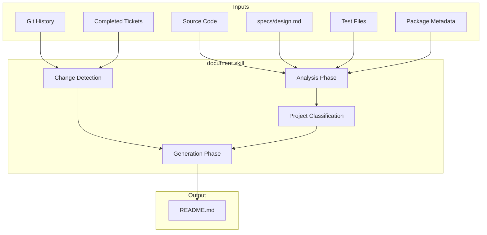

# Documentation Skill Design

## Overview

A skill that generates comprehensive, single-file documentation for projects by analyzing code, specs, tests, and package metadata. Runs after each epic is verified, producing a complete README.md that represents the current state and capabilities of the project.

This skill closes the gap between implemented code and user-facing documentation, ensuring the README is always an accurate reflection of what the project does.

## Detailed Requirements

### Functional Requirements

| ID | Requirement |
|----|-------------|
| FR-1 | Generate README.md from scratch each invocation |
| FR-2 | Analyze source code to understand structure and behavior |
| FR-3 | Extract context from specs/design.md if present |
| FR-4 | Infer usage patterns from test cases |
| FR-5 | Read package metadata (package.json, Cargo.toml, pyproject.toml, etc.) |
| FR-6 | Detect project type (library vs application) |
| FR-7 | Scale API documentation based on project type |
| FR-8 | Produce 7-section README structure |

### Non-Functional Requirements

| ID | Requirement |
|----|-------------|
| NFR-1 | README must be comprehensive but readable |
| NFR-2 | Documentation must be accurate to current code state |
| NFR-3 | Must work across project types (CLI apps, libraries, services) |
| NFR-4 | Must detect changes via git diff, ticket scope, and full scan |

### Trigger Requirements

| ID | Requirement |
|----|-------------|
| TR-1 | Invoke after all tickets in an epic are verified |
| TR-2 | Invoke before reporting epic completion to user |
| TR-3 | Do not require explicit user input about what to document |

## Architecture Overview



## Components and Interfaces

### 1. Analysis Component

**Purpose:** Gather and synthesize information from all sources.

**Inputs:**
- Source code files
- specs/design.md (optional)
- Test files
- Package metadata files

**Outputs:**
- Project structure understanding
- Feature inventory
- Usage patterns
- Dependencies and requirements

**Process:**
1. Scan project structure (files, directories)
2. Identify entry points (main file, exports)
3. Extract public interfaces (functions, types, classes)
4. Parse tests for usage examples
5. Read package metadata for name, version, dependencies

### 2. Change Detection Component

**Purpose:** Determine scope of documentation effort.

**Inputs:**
- Git diff since last documentation
- Completed tickets from epic
- Full project state

**Outputs:**
- Changed areas requiring attention
- New features to document
- Removed features to prune

**Process:**
1. Check git diff for changed files
2. Cross-reference with completed tickets
3. Full scan for undocumented features
4. Combine findings into documentation scope

### 3. Classification Component

**Purpose:** Determine project type to scale documentation appropriately.

**Inputs:**
- Project structure
- Package metadata
- Entry points

**Outputs:**
- Project type: library | application | cli | service
- API documentation level: full | minimal | none

**Classification Rules:**
| Signal | Project Type |
|--------|--------------|
| Has bin/ or main.go, main.py, index.js | Application/CLI |
| Has lib/, src/lib/, exports | Library |
| Has HTTP handlers, server.go | Service |

### 4. Generation Component

**Purpose:** Produce the README.md content.

**Inputs:**
- Analysis results
- Classification results
- Change scope

**Output:**
- Complete README.md content

**Template:**
```markdown
# {Project Name}

{Tagline - one sentence description}

## Overview

{What it does, why it exists, key features}

## Installation

{How to install - platform specific if needed}

## Quick Start

{Minimal example to get running}

## Usage Guide

{Full feature walkthrough with examples}

## Deep Reference

{Detailed behavior, options, edge cases, configuration}

## API Documentation

{For libraries: full API reference}
{For apps: minimal or omitted}
```

## Data Models

### ProjectAnalysis

```
ProjectAnalysis {
  name: string
  type: "library" | "application" | "cli" | "service"
  language: string
  entry_points: string[]
  features: Feature[]
  dependencies: Dependency[]
  usage_patterns: UsagePattern[]
}
```

### Feature

```
Feature {
  name: string
  description: string
  examples: CodeExample[]
  options: Option[] (if applicable)
}
```

### UsagePattern

```
UsagePattern {
  source: "test" | "code" | "spec"
  scenario: string
  code: string
}
```

## Error Handling

| Scenario | Handling |
|----------|----------|
| No source files found | Report error, cannot document empty project |
| No package metadata | Infer from directory name, proceed with limited info |
| specs/design.md missing | Proceed with code analysis only |
| No tests | Skip usage pattern extraction from tests |
| Ambiguous project type | Default to "application" |
| Git not available | Skip git diff, rely on ticket scope + full scan |

## Acceptance Criteria

### AC-1: README Generation
```
Given a project with source code and package metadata
When the document skill is invoked
Then README.md is generated with all 7 sections
And the README accurately reflects the current project state
```

### AC-2: Library API Documentation
```
Given a project classified as a library
When the document skill generates README.md
Then the API Documentation section contains full reference
Including all public functions with signatures and descriptions
```

### AC-3: Application Documentation
```
Given a project classified as an application or CLI
When the document skill generates README.md
Then the Usage Guide section is comprehensive
And the API Documentation section is minimal or omitted
```

### AC-4: Change Detection
```
Given an epic with completed tickets and git history
When the document skill runs
Then it considers git diff, ticket scope, and full scan
And documentation reflects all changes from the epic
```

### AC-5: Information Sources
```
Given a project with code, specs/design.md, tests, and package.json
When the document skill analyzes the project
Then all sources are consulted
And the README reflects synthesized information from all sources
```

### AC-6: Overwrite Behavior
```
Given an existing README.md
When the document skill generates documentation
Then the existing README is completely replaced
And the new README is generated from current understanding
```

## Testing Strategy

### Unit Tests
- Classification logic (library vs app detection)
- Template section generation
- Change detection scope calculation

### Integration Tests
- Generate README for sample library project
- Generate README for sample CLI project
- Handle missing specs/design.md gracefully
- Handle missing tests gracefully

### Verification
- Read generated README, verify against code accuracy
- Check all 7 sections present
- Verify API docs scaled appropriately for project type

## Appendices

### A. Project Type Detection Heuristics

| File/Pattern | Project Type |
|--------------|--------------|
| `package.json` with `bin` | CLI |
| `main.go`, `main.py`, `index.js` | Application |
| `Cargo.toml` with `[lib]` | Library |
| `setup.py`, `pyproject.toml` with packages | Library |
| HTTP server listeners | Service |

### B. Package Metadata Sources

| Language | Files |
|----------|-------|
| JavaScript/TypeScript | package.json |
| Rust | Cargo.toml |
| Python | pyproject.toml, setup.py |
| Go | go.mod |
| Ruby | Gemfile, *.gemspec |

### C. Integration with choo-choo Workflow

```
execute → verify → [all tickets verified?]
                          ↓ yes
                    document skill
                          ↓
                    README.md updated
                          ↓
                    Report epic completion to user
```

Position in skills table:
| document | Documentation | Epic verified, before completion report | README.md |
