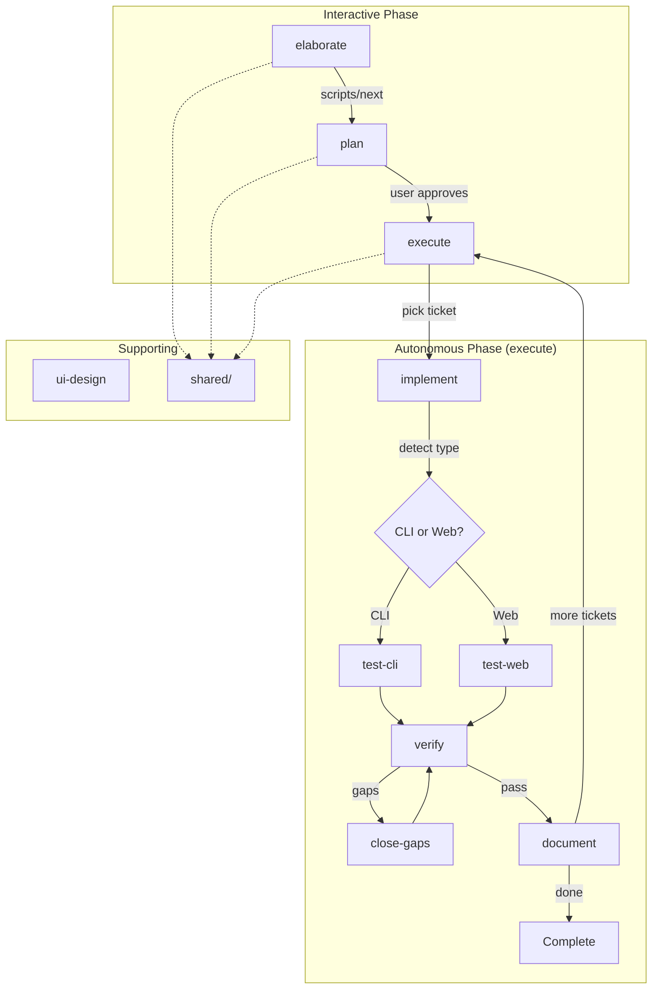

# Skill Restructure Design

## Overview

This design restructures the agent-skills repository from a nested "choo-choo-skills" collection to a flat, spec-compliant structure with script-based skill transitions. Each skill becomes independently discoverable and invocable, with handoffs managed by executable `next` scripts and self-sufficiency via `bootstrap` scripts.

---

## Detailed Requirements

1. **Discoverability**: Skills must be immediately recognizable by name and purpose
2. **Decoupling**: Skills must not hardcode relative paths to other skills
3. **Transitions**: Skill handoffs must be executable, not just documented
4. **Compliance**: Structure must work when symlinked to client skill directories
5. **Shared Resources**: Cross-skill documentation must be DRY but accessible
6. **Self-Sufficiency**: Skills must bootstrap their own dependencies
7. **Testing Split**: CLI/TUI and Web testing use different tools and patterns
8. **Autonomous Mode**: A skill that runs the full virtuous cycle hands-off

---

## Architecture Overview



---

## Components and Interfaces

### 1. Skill Directories

Each skill is a top-level directory containing `SKILL.md`:

| Skill | Purpose | Former Name |
|-------|---------|-------------|
| `elaborate` | Requirements clarification → Architecture design | `design` |
| `plan` | Decompose design into ticket tree | `plan` |
| `execute` | **Autonomous virtuous cycle** - runs until done | *(new)* |
| `implement` | Implement single ticket (TDD) | `execute` |
| `verify` | Confirm implementation vs acceptance criteria | `verify` |
| `close-gaps` | Fix discrepancies found by verify | `close-gaps` |
| `document` | Generate README.md | `document` |
| `test-cli` | CLI/TUI testing via tmux | `test` |
| `test-web` | Web testing via agent-browser | *(new)* |
| `ui-design` | UI/UX interaction patterns | `ui-design` |

### 2. Script Interface: `next`

Each workflow skill has `scripts/next`:

```bash
#!/usr/bin/env bash
# Usage: next [--context <state-file>] [--json]
#
# Outputs (line-delimited):
#   Line 1: Next skill name (or "done" or "blocked")
#   Line 2: Context/argument to pass
#   Line 3: Human-readable reason
#
# Exit codes:
#   0 - Has next step
#   1 - Workflow complete
#   2 - Blocked (requires human input)
```

### 3. Script Interface: `bootstrap`

Each skill with external dependencies has `scripts/bootstrap`:

```bash
#!/usr/bin/env bash
# Usage: bootstrap [--check] [--install]
#
# Options:
#   --check     Only check, don't install (dry run)
#   --install   Install missing dependencies
#
# Outputs:
#   Line 1: "ready" or "missing"
#   Line 2+: List of missing dependencies (if any)
#   Line N: Installation commands that would be run
#
# Exit codes:
#   0 - All dependencies satisfied
#   1 - Missing dependencies (with --check)
#   2 - Installation failed (with --install)
```

### 4. Application Type Detection

The `execute` skill detects application type to route testing:

```bash
detect_app_type() {
    # Web application indicators
    if [[ -f "package.json" ]] && grep -q "next\|vite\|react\|vue\|svelte\|astro" package.json 2>/dev/null; then
        echo "web"
        return
    fi
    if [[ -f "index.html" ]] || [[ -f "app.html" ]]; then
        echo "web"
        return
    fi
    if [[ -f "go.mod" ]] && grep -q "net/http" go.mod 2>/dev/null; then
        echo "web"
        return
    fi
    
    # Check design.md for explicit marker
    if find specs -name "design.md" -exec grep -l "type:\s*web\|type:\s*api" {} \; 2>/dev/null | head -1 | grep -q .; then
        echo "web"
        return
    fi
    
    # Default to CLI
    echo "cli"
}
```

### 5. `shared/` Directory

```
shared/
├── STATE-structure.md      # State file format
├── workflow.md             # Overall workflow documentation
├── bootstrap-template.md   # Template for bootstrap scripts
├── next-template.md        # Template for next scripts
└── detection-patterns.md   # App type detection patterns
```

Skills reference via: `../shared/STATE-structure.md`

---

## Bootstrap Dependencies by Skill

| Skill | Dependencies | Bootstrap Actions |
|-------|--------------|-------------------|
| `elaborate` | bash, git | Verify only |
| `plan` | bash, git, fzf (optional) | Install fzf if missing |
| `execute` | bash, git | Verify only |
| `implement` | bash, git, language-specific (go, node, python) | Detect and report |
| `verify` | bash, git | Verify only |
| `close-gaps` | bash, git | Verify only |
| `document` | bash, git | Verify only |
| `test-cli` | bash, tmux | Install tmux if missing |
| `test-web` | bash, agent-browser | Install agent-browser: `cargo install agent-browser` or download binary |
| `ui-design` | bash | Verify only |

### Bootstrap Template

```bash
#!/usr/bin/env bash
set -euo pipefail

SCRIPT_DIR="$(cd "$(dirname "${BASH_SOURCE[0]}")" && pwd)"
SKILL_DIR="$(dirname "$SCRIPT_DIR")"

CHECK_ONLY=false
INSTALL=false

for arg in "$@"; do
    case "$arg" in
        --check) CHECK_ONLY=true ;;
        --install) INSTALL=true ;;
    esac
done

# Define dependencies
declare -A DEPS=(
    ["tmux"]="tmux -V"
    ["agent-browser"]="agent-browser --version"
)

missing=()
install_cmds=()

for dep in "${!DEPS[@]}"; do
    if ! command -v "$dep" &>/dev/null; then
        missing+=("$dep")
        case "$dep" in
            "tmux") install_cmds+=("brew install tmux || apt install tmux") ;;
            "agent-browser") install_cmds+=("cargo install agent-browser") ;;
        esac
    fi
done

if [[ ${#missing[@]} -eq 0 ]]; then
    echo "ready"
    exit 0
fi

echo "missing"
printf '%s\n' "${missing[@]}"
printf '%s\n' "${install_cmds[@]}"

if $INSTALL; then
    for cmd in "${install_cmds[@]}"; do
        echo "Installing: $cmd"
        eval "$cmd" || exit 2
    done
    echo "ready"
    exit 0
fi

if $CHECK_ONLY; then
    exit 1
fi

# Interactive prompt
echo "Run bootstrap with --install to install missing dependencies"
exit 1
```

---

## Data Models

### STATE.md (project-level, created by skills)

```yaml
---
phase: elaborate | plan | execution | verification | gap-closure | done
epic: <ticket-id>
focus: <ticket-id>
started: <ISO-8601>
app_type: cli | web
learnings:
  - <string>
decisions:
  - <string>
---
```

### STATUS.md (autonomous execution progress)

```markdown
# Execution Status

**Started:** 2026-03-25T10:00:00Z
**Phase:** execution
**App Type:** web

## Tickets

| ID | Status | Verified |
|----|--------|----------|
| T-001 | done | ✅ |
| T-002 | done | ✅ |
| T-003 | in_progress | - |
| T-004 | todo | - |

## Progress

### T-001: Setup project structure
- Implemented: 2026-03-25T10:15:00Z
- Verified: 2026-03-25T10:20:00Z

### T-003: Implement auth (current)
- Started: 2026-03-25T11:00:00Z
- Tests written, implementing...

## Issues Found
- None

## Blockers
- None
```

---

## Error Handling

| Scenario | Handling |
|----------|----------|
| `next` called with incomplete state | Exit 2, output "blocked" with reason |
| Target skill not found | Exit 2, output "blocked" with skill name |
| STATE.md missing | Skills read/write STATE.md, create if missing |
| Shared file not found | Skill fails with clear error message |
| Bootstrap dependency missing | Prompt to run with `--install` |
| agent-browser not found | Download binary or cargo install |
| tmux not found | Package manager install (brew/apt) |

---

## Acceptance Criteria

```gherkin
Given I have the restructured agent-skills repo
When I symlink it to ~/.config/crush/skills/
Then Crush discovers all 10 skills by name

Given I invoke elaborate/scripts/bootstrap --check
When tmux is not installed
Then it outputs "missing" and lists tmux

Given I invoke test-web/scripts/bootstrap --install
When agent-browser is not installed
Then it installs agent-browser via cargo

Given I complete the elaborate skill
When I run ./elaborate/scripts/next
Then it outputs "plan" with the spec path

Given execute skill is running autonomously
When it detects a web application
Then it invokes test-web for testing

Given execute skill is running autonomously
When all tickets are complete
Then it generates documentation and outputs "done"
```

---

## Testing Strategy

1. **Skill Discovery**: Symlink repo, verify Crush lists all skills
2. **Bootstrap Scripts**: Run each `bootstrap --check`, verify detection
3. **Bootstrap Installation**: Run `bootstrap --install`, verify tools installed
4. **next Scripts**: Run each `next` script with mock state, verify output format
5. **App Detection**: Test `detect_app_type` with various project structures
6. **Transition Flow**: Execute full workflow from elaborate → done
7. **Shared References**: Verify skills can read `../shared/` files

---

## File Mapping

| Old Path | New Path |
|----------|----------|
| `choo-choo-skills/design/SKILL.md` | `elaborate/SKILL.md` |
| `choo-choo-skills/plan/SKILL.md` | `plan/SKILL.md` |
| `choo-choo-skills/execute/SKILL.md` | `implement/SKILL.md` |
| *(new)* | `execute/SKILL.md` |
| `choo-choo-skills/verify/SKILL.md` | `verify/SKILL.md` |
| `choo-choo-skills/close-gaps/SKILL.md` | `close-gaps/SKILL.md` |
| `choo-choo-skills/document/SKILL.md` | `document/SKILL.md` |
| `choo-choo-skills/test/SKILL.md` | `test-cli/SKILL.md` |
| *(new)* | `test-web/SKILL.md` |
| `choo-choo-skills/ui-design/SKILL.md` | `ui-design/SKILL.md` |
| `choo-choo-skills/shared/STATE-structure.md` | `shared/STATE-structure.md` |
| `choo-choo-skills/plan/scripts/ticket` | `plan/scripts/ticket` |
| `choo-choo-skills/test/scripts/test` | `test-cli/scripts/test` |
| `choo-choo-skills/design/scripts/init-spec` | `elaborate/scripts/init-spec` |
| `choo-choo-skills/SKILL.md` | *(deleted - meta skill)* |

---

## Symlink Update

```bash
# Remove old symlink
rm ~/.config/crush/skills/choo-choo-skills

# Create new symlink (repo root becomes the skills directory)
ln -s ~/Code/agent-skills ~/.config/crush/skills/agent-skills
```
